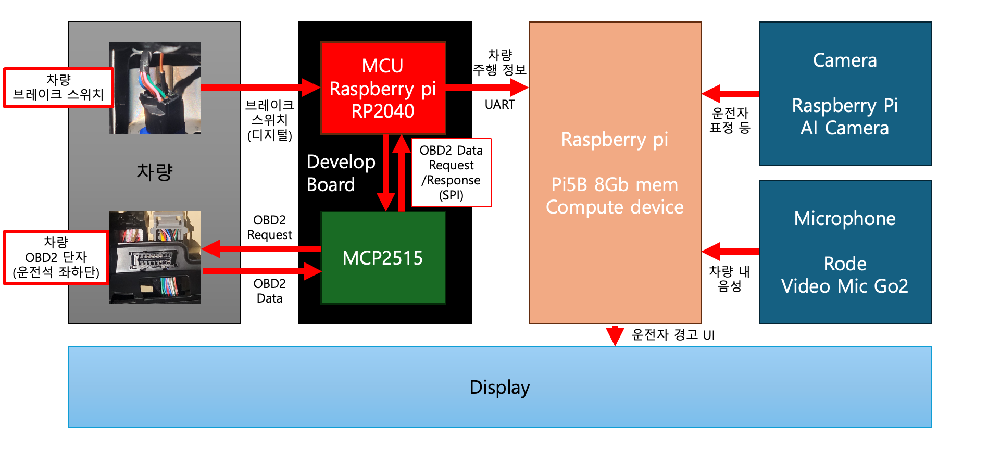
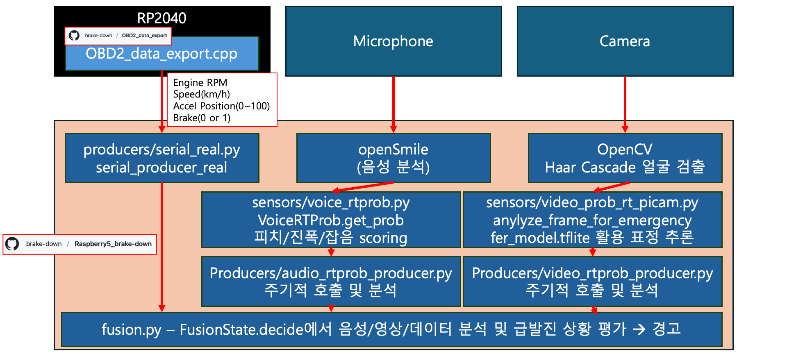
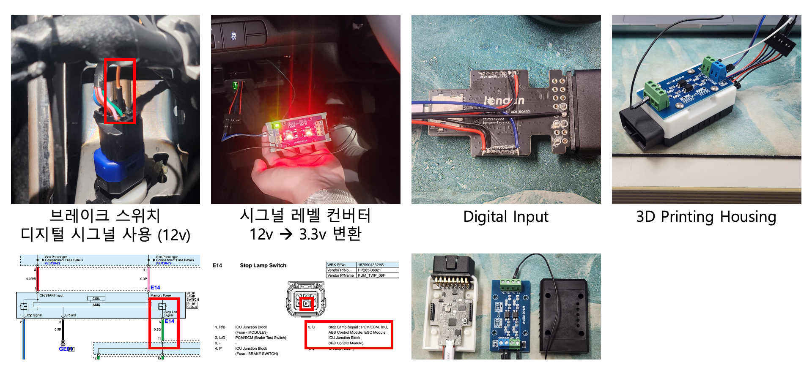
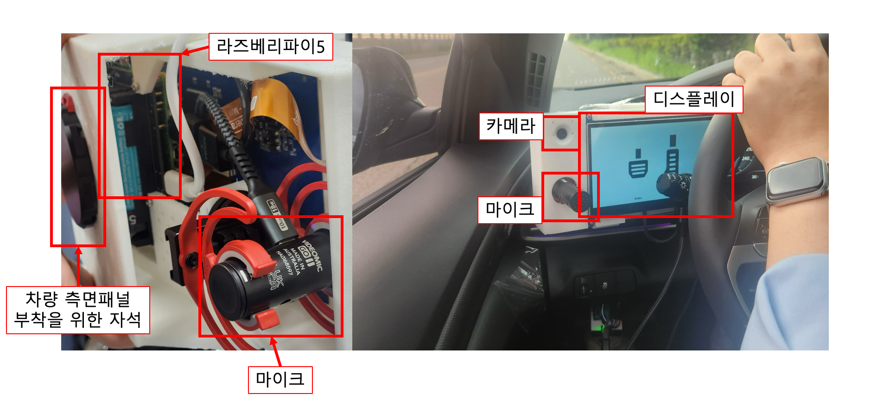

# 🚗 Is Not Break Down (BRAKEDOWN)

페달 오인 감지 및 경고 시스템을 개발하는 팀 **BRAKEDOWN**의 GitHub Organization입니다.  
본 프로젝트는 **OBD-II 데이터와 브레이크 신호, 영상·음성 인식 기술**을 융합하여  
운전자의 **페달 오조작(브레이크 대신 가속 페달 밟기 등)** 을 감지하고,  
즉각적인 경고를 통해 사고를 예방하는 것을 목표로 합니다.  

---

## 🔎 프로젝트 개요
- **작품명**: *Is Not Break Down*  
- **개발 배경**  
  - 국립과학수사연구원 보고: 급발진 의심사고 364건 중 **88.2%가 페달 오조작**  
  - 고령 운전자 비율 증가: 2024년 기준 **65세 이상 인구 18.4%**,  
    고령 운전자가 가해자인 교통사고 비율 **21.6%**  
  - 전기차 원페달 드라이빙 확산 → 오조작 위험성 증가
 
  - 사회적으로 **영향력 있는 사람들이 페달 오인 문제를 축소하고 이를 급발진으로 호도하는 경향**이 존재함  
    이 현상은 **사회적 인식 왜곡**으로 이어지며, 아래 영상이 가장 잘 설명하고 있음  
    [급발진?? 이 사람들을 절대 믿지 마라 (YouTube)](https://youtu.be/SaER2PktSWk?si=9-U6R1JntVj8gaO6)  
    이에 따른 **올바른 사고 원인에 대한 사회적 인식 재고가 필요함**

  ### 실질적으로 페달 오인 시 **페달 오인에 대한 인지만으로** 사고를 예방할 수 있음

- **개발 목표**  
  - OBD-II + 브레이크 신호 + 영상/음성 분석 기반 **오인 상황 인식**  
  - **운전자 경고 및 사고 예방**  
  - **부착형 설계**를 통한 기존 차량 호환성 확보  

---

## 🛠️ 개발 환경
- **MCU**: [RP2040 (Longan Labs 보드)](https://docs.longan-labs.cc/1030003/)  
- **컴퓨팅 보드**: Raspberry Pi 5B (8GB)  
- **센서**: OBD-II, 브레이크 스위치, 카메라, 마이크  
- **분석 도구**: OpenCV (얼굴 인식), openSmile (음성 분석), TensorFlow Lite (표정 추론)  
- **통신**: CAN (MCP2515), UART  

---

## 📂 레포지토리 구성

- **펌웨어(Firmware)**  
  - [OBD2_data_export](https://github.com/brake-down/OBD2_data_export)  
  - RP2040 기반 MCU에서 실행되며, 차량 OBD-II 데이터를 요청 및 수집하는 기능 담당  

- **컴퓨트 코드(Compute Code)**  
  - [Raspberry5_brake-down](https://github.com/brake-down/Raspberry5_brake-down)  
  - Raspberry Pi 5B 상에서 실행되며,  
    - OBD-II/브레이크 신호 처리  
    - 음성/영상 인식 (openSmile, OpenCV, TFLite)  
    - Fusion 로직을 통한 상황 판단 및 경고 제공  
  - 운전자 인터페이스(UI) 및 경고 알림 기능 포함

- **3D 리소스(3D Resource)**  
  - [3d_resource](https://github.com/brake-down/3d_resource)  
  - 하드웨어 부착 및 장치 제작에 활용되는 **3D 모델(STL 파일 등)** 을 포함  

- **UI 리소스(UI Resource)**  
  - [UI_resource](https://github.com/brake-down/UI_resource)  
  - 운전자 인터페이스 설계 및 시각화에 사용되는 **이미지/그래픽 리소스**를 포함 

---

## ✨ 차별성
- 기존 블랙박스·기록 장치는 **사후 기록용** → 본 시스템은 **실시간 감지 + 경고 제공**  
- **OBD-II 표준 기반** → 범용성과 설치 용이성 확보  
- 음성·영상·주행 데이터를 **융합 분석**하여 정밀한 상황 판단 가능  
- 일본식 내장형 제어장치와 달리 **저비용·고효율 보조 장치**로 구현  

---

## 🌍 파급력 및 기대효과
- 고령 운전자 사고 예방 및 **사회적 안전망 강화**  
- **저비용·고효율 솔루션**으로 중고차·고령층 시장에서도 높은 판매 가치  
- **보험사 연계** 시 사회·경제적 비용 절감 효과 극대화  
- **정부·지자체 정책 연계 가능성** (고령 운전자 지원 정책 등)  
- 자율주행/ADAS와의 **기술 융합 및 발전 가능성**

---

## 🔧 개선 방향
- 전문 **UI 개발팀 부재**로 인해 인터페이스 개선의 여지 존재  
- 현재 테스트 차량(아반떼)에서는 **클러스터 좌측에 장착**하여, 클러스터 연장선의 느낌을 살린 디자인으로 구현  
- **일반적인 내비게이션 위치(우측)** 나 **HUD(Head-Up Display)** 방식으로 개선하여 운전자의 시인성과 사용성이 더욱 향상될 수 있음  

---

## 👥 팀 구성
|||||
|:-:|:-:|:-:|:-:|
|이진성 [@Bina-Lee](https://github.com/Bina-Lee) 팀장 · PM 데이터 수집부 펌웨어 / 하드웨어 설계|박소윤 [@psy1218](https://github.com/psy1218) 코드 통합 및 판단 로직 설계 / 최적화|곽민지 [@gwakminji](https://github.com/gwakminji) 영상처리 / UI 설계|김민서 [@noidnoidnoid3](https://github.com/noidnoidnoid3) 음성처리 / UI 설계|
 

---

> 본 프로젝트는 **제23회 임베디드SW경진대회 (자유공모 부문)** 출품작입니다.  
